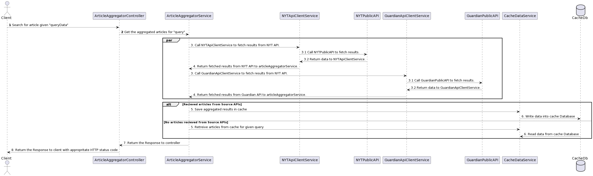

<h1 align="center">Newsify Backend 🦉 </h1>

## LINKS
### Swagger API Doc: http://13.50.134.52:8081/docs/api-docs.html
### Jenkins: http://13.50.134.52:8080/
*NOTE: These may not be accessible if my instance is in stopped state

## About
Newsify Backend API provides the articles for the given query and have the following features:
- Newsify Backend API supports **pagination**, serves the data as and when required by clients.
- Newsify Backend API supports **caching mechanism** as well making data available even when the source APIs fail to deliver the data.
- Newsify Backend API uses [New York Times](https://developer.nytimes.com/apis) and [The Guardian](https://open-platform.theguardian.com/) as its source APIs.

## Key Features
- Supports Pagination using offset and limit params
- Supports External configuration injection using .env file
- CI/CD enabled using Jenkins and docker
- API documented using Swagger

## Built with 🛠
- Spring Boot
- Java Core
- H2 Database - In Memory DB for testing and development
- Postgresql - For prod
- Swagger
- Hibernate/JPA

## Architecture

## Sequence Diagram

## Future features
- Authentication using JWT
